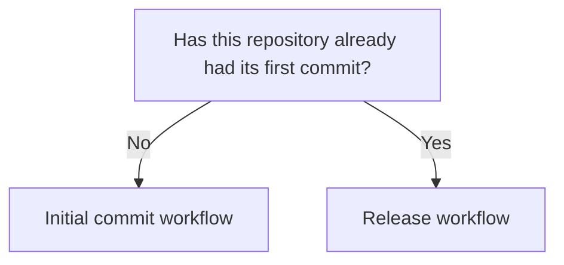

# Commit and Versioning Workflow

Version: 0.2.0
Status: Draft
Style Guide: style-guide--versioned-documents-in-unrendered-markdown

## Abstract

Two paths, one for the first commit and one for every release after it, because they do not follow the same steps or produce the same kind of commit message.

## Which workflow



GitHub's mermaid renderer strips click links, so on github.com the chart is visual only; the section headings below are the actual navigation.

## Initial commit workflow

Use this once, the first time the repository is committed.

### Verify the branch

```bash
git status
```

If not on `main`:

```bash
git checkout -b main
```

### Stage and review

```bash
git add .
git status
```

The `git status` output after staging is used directly in the commit body. At initial commit this is the full file listing, every file is new. This full listing is expected only here; ordinary releases produce a much shorter list.

### Commit

Summary line, then the staged file list from `git status`:

```bash
git commit -m "Initial commit, v0.1.0

	new file:   VERSION
	new file:   README.md
	new file:   CHANGELOG.md
	new file:   bump-version.py
	new file:   cut-release.py
	new file:   en/docs/README.md
"
```

### Tag and push

Use `-u` on this first push only:

```bash
git tag v0.1.0
git push -u origin main
git push origin v0.1.0
```

Every future release goes through the release workflow below.

## Release workflow

Use this for every release after the initial commit.

### Write the changelog entries

As work happens, add entries to `CHANGELOG.md`'s `## [Unreleased]` section by hand, under `### Added`, `### Changed`, or `### Removed` as appropriate. This is a separate concern from cutting the release itself: `cut-release.py` reads what's already there, it never writes changelog prose.

### Cut the release

```bash
python3 cut-release.py patch
```

Or `minor`, `major`, or an explicit version. This calls `bump-version.py` to write `VERSION`, rolls `CHANGELOG.md`'s `Unreleased` section into a dated `## [X.Y.Z] - YYYY-MM-DD` heading, leaves a fresh empty `Unreleased` above it, commits `VERSION` and `CHANGELOG.md` surgically, never `git add .`, guards that `HEAD:VERSION` matches, tags, and guards the tag. It stops before push.

Output example:

```bash
VERSION: 0.1.3 -> 0.1.4
CHANGELOG.md: [Unreleased] -> ## [0.1.4] - 2026-07-28
[main b03266b] release 0.1.4
 2 files changed, 3 insertions(+), 1 deletion(-)

[RELEASE] 0.1.3 -> 0.1.4, tagged v0.1.4.
  Nothing pushed. Push when ready:
    git push && git push origin v0.1.4
```

### Push

Pushing stays a deliberate, separate act. cut-release.py never does it for you.

Run the push command

```bash
git push && git push origin v0.1.4
```

output example:

```bash
Enumerating objects: 19, done.
Counting objects: 100% (19/19), done.
Delta compression using up to 8 threads
Compressing objects: 100% (10/10), done.
Writing objects: 100% (12/12), 6.24 KiB | 6.24 MiB/s, done.
Total 12 (delta 3), reused 0 (delta 0), pack-reused 0
remote: Resolving deltas: 100% (3/3), completed with 2 local objects.
To github.com:steelcj/sat-doc-automa.git
   cb48d31..b03266b  main -> main
Enumerating objects: 1, done.
Counting objects: 100% (1/1), done.
Writing objects: 100% (1/1), 169 bytes | 169.00 KiB/s, done.
Total 1 (delta 0), reused 0 (delta 0), pack-reused 0
To github.com:steelcj/sat-doc-automa.git
 * [new tag]         v0.1.4 -> v0.1.4
```

#### Troubleshooting

It your push refuses, rather than proceeding, if `VERSION` already has uncommitted changes (a previous release was left half-done), if `Unreleased` is empty (nothing written to release), or if the target tag already exists (tags are never reused; fix forward with the next version number).

## License

This document, *Commit and Versioning Workflow*, by **Christopher Steel**, with AI assistance from **Claude Sonnet 4.6 (Anthropic)** and **Claude Sonnet 5 (Anthropic)**, is licensed under the [GNU Affero General Public License v3.0 or later](https://www.gnu.org/licenses/agpl-3.0.html).

## Changelog

| Version | Status | Notes |
|---------|--------|-------|
| 0.2.0 | Draft | Replaced the manual version-bump workflow with cut-release.py; renamed the section to "Release workflow"; added cut-release.py to the initial-commit file listing |
| 0.1.3 | Draft | Reorganized and restored en/docs |
| 0.1.2 | Draft | Minor edits |
| 0.1.1 | Draft | Compliance pass: replaced the em dash in the initial-commit example message with a comma |
| 0.1.0 | Draft | Initial draft, generalized from the osat-fluent-rclone-tool workflow into a project-neutral guide |
