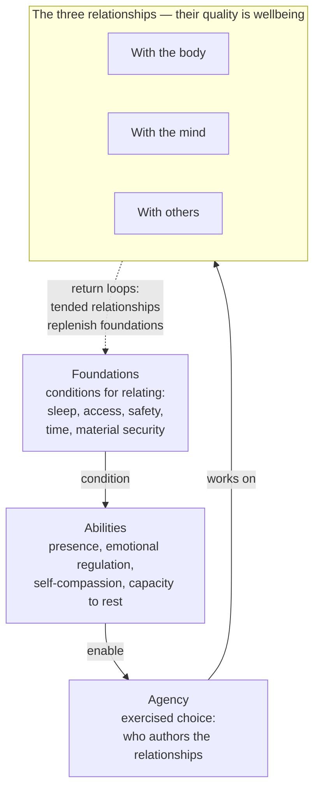
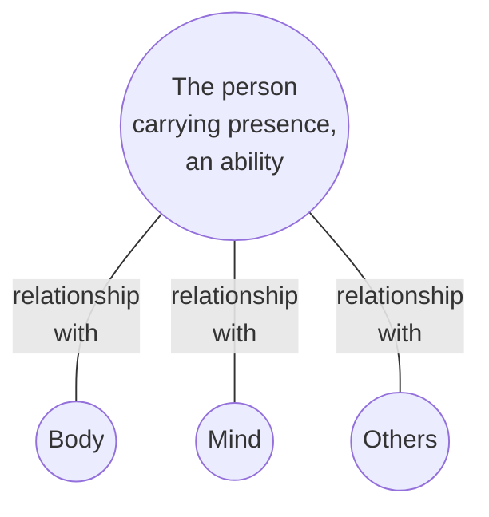

# universal-cake-wellbeing-evaluation-metrics-v0.2.0

Version: 0.2.0
Status: Draft

## Purpose

The general idea is the same one that animates the parent metrics: support more people in better ways that support wellbeing. Where the parent document evaluates products, services, and technical approaches, this document evaluates ideas, tools, and practices that claim to bring about wellbeing directly — meditation apps and meditation itself, exercise programs, therapy modalities, journalling methods, sleep tools, courses, communities, retreats, and habits of any kind.

What this framework works on, at every level, are the qualities of relationships. Wellbeing, as measured here, is the quality of a person's relationships with their body, their mind, and others. The sphere metrics measure those three relationships. The abilities are relational capacities. Agency asks who authors the relationships. And the practice-level pillars evaluate a fourth relationship — the person's relationship with the practice, vendor, or teacher itself — to check whether that relationship is worthy of mediating the other three. A claim this unifying stays honest only by staying operational: every relationship in this framework has named parties, measurable qualities, evidence tags, and gates. A relationship whose power balance can be named is a claim; one that cannot is marketing.

The wellbeing space needs this evaluation more than most. It is dense with unverifiable claims, guru dependence, subscription models that hold benefits hostage, and products that market presence while running on distraction. An evaluator that makes the difference visible — between what is claimed and what is verified, between what builds capacity and what builds dependence — is the tool this document defines.

## How to read this document

This document is the most upstream object in the system it defines. Every evaluation, radar entry, and adoption decision flows downstream from someone reading and understanding it. If the document itself fails accessibility, the failure propagates through everything built on it, and it propagates invisibly, because the excluded people never arrive. The burden of entry therefore sits with this artifact, not with the reader. The following obligations apply to this document and to every document derived from it.

**Prose is normative; diagrams are navigation.** Every diagram in this document is preceded by a brief paragraph describing it, and followed by subsections describing each item it contains. The diagram serves as a map of the subsections below it — the section heading above a diagram names the territory, the diagram sketches it, the subsections below walk it. A reader who cannot see the diagram loses nothing normative; a reader who can see it gains a navigational overview. Mermaid output is treated as illustration, never as the sole carrier of meaning.

**Dual register.** This is the technical reference document. A plain-language companion, targeting a Grade 7 reading level, is a committed deliverable, not an aspiration; its status is tracked in the self-application section below. The companion is the ticket booth; this document is the archive.

**Language feasibility.** Translation of this document is a data file anyone can supply — it is markdown, and nothing in its structure resists translation. Target languages follow the Vishpala commitment: English, Canadian French, Spanish. Current status is tracked in the self-application section.

## The model

Wellbeing, in this framework, is the quality of a person's relationships with their body, their mind, and others. That quality is worked on with abilities the person carries, and those abilities are conditioned by foundations — the conditions for relating at all. Influence flows mainly from foundations upward, but not only upward: relationships tended well replenish the foundations they rest on.

The diagram below maps this section. Each named item in it is described in a subsection following the diagram, in top-to-bottom order: foundations, abilities, agency, the three relationships, wellbeing, and the return loops.

### Foundations

Foundations are the conditions for relating — requirements the relating rests on, not relationships being conducted. Sleep. Access, in both its faces: accessibility, and the languages and modalities of communication. Safety, physical and psychological. Time. Material security.

Foundations are themselves qualities on a continuum, not binaries. Sleep is not present or absent; it is better or worse, and its quality varies nightly. The same is true of safety, of time, of material security, and of most access questions. Foundations condition the abilities available for relationship work — they set the terms, they do not cast the vote. People work on relationships from damaged foundations all the time, at higher cost and lower capacity.

**Upstream reach.** Foundations tend to be high-leverage not by rank but by connectivity: they sit upstream of many effects, so an improvement to one travels. Sleep is the clearest example. Quality of sleep affects a whole lot of things — emotional regulation, the capacity for presence, energy, patience with others — so working on sleep helps a lot, one improvement propagating through the abilities and into all three relationships. Upstream improvements tend to travel furthest. This is the leverage principle behind the effects discussion required of every evaluation (see Layer two preliminaries), and it is why this document holds itself to its own access obligations: the document is upstream of every evaluation made with it.

**Access as the ticket.** Access deserves naming among the foundations because it is the gate of entry to any practice — and to this framework. A person cannot bring presence to a practice they cannot enter, cannot exercise agency within claims they cannot understand, and receives nothing from a practice that excludes their body, their language, or their way of communicating. Accessibility failures are asymmetries of capability; communication failures — inflated claims, concealed harms, undisclosed costs — are asymmetries of information. Both attack the same point, the person's ability to enter and choose, and both are instances of the pattern the measuring-dependence principles below make measurable. The tickets are issued by the venue: access is an obligation the practice must meet, not a quality the person must bring.

### Abilities

Abilities are relational capacities the person carries — what remains when the practice, tool, or teacher is taken away. They are conditioned by the foundations and deployed, through agency, to work on the relationships.

- **Presence.** The load-bearing ability, first among them because agency depends on it. A person cannot choose among options they have not noticed, and cannot notice without being there. Presence opens the gap between stimulus and response. It is trainable, it atrophies under hostile conditions — the attention economy is precisely such a condition — it is deployable across all three relationships, and it is measurable with validated instruments (MAAS, FFMQ acting-with-awareness facet).
- **Emotional regulation.** The capacity to notice, name, tolerate, and modulate emotional states — how a person relates to their own states rather than being run by them. Depends on presence; an emotion not noticed cannot be regulated.
- **Self-compassion.** The quality of the relationship with oneself in failure. Practices that motivate through shame score Weak here even when they produce short-term compliance.
- **Capacity to rest.** The ability to stop, genuinely, without guilt and without a screen. Increasingly rare, rarely trained, and a legitimate output for a practice to claim.

Two forms of presence are evaluated separately throughout. **State presence** is being here, now, during the practice itself, evaluated as a thread through each relationship. **Trait presence** is the cultivated capacity retained afterward, evaluated with the engage/build question pair below. A practice can score well on one and not the other: a gripping game engages attention totally and builds nothing transferable; effortful meditation training may be unglamorous in the moment and build the trait. The best practices do both.

Two honesty clarifications keep the model from mindfulness maximalism. Presence is not sufficient for wellbeing — attention is neutral, and a person can be intensely present in an activity that harms them, or present within a hostile relationship; presence is the bandwidth, relationship quality is what the bandwidth carries. And presence is not strictly necessary for every foundation — sleep involves no presence at all, which is part of why sleep belongs among the foundations rather than the relationships.

This list of abilities is non-exhaustive. New abilities are added as evaluation demands, using the same engage/build question pair.

### Agency

Agency is exercised choice: the question of who authors the relationships — whether the person's relationships with body, mind, and others are theirs, or arranged for them by someone else's design. Every interaction with a subject can be tested with the parent metrics' question, **whose goal does this interaction serve, and would the person recognize it as their own?**

Dark patterns are attacks on presence in order to defeat agency. Infinite scroll does not argue with a person's goals; it prevents the moment of noticing in which those goals would be consulted. Autoplay removes the stopping point precisely because a stopping point is where presence re-enters and a choice gets made. Manufactured urgency floods the gap so nothing deliberate can happen in it. Supportive patterns are the mirror image: honest defaults, natural endings, and quiet-by-default all protect the gap. Every practice-level question below has a common root: does this subject widen the gap or close it?

### The three relationships

The diagram below maps this subsection: the person at the centre, carrying presence, connected independently to the three domains. Wellbeing lives on the edges — the three lines are the relationships whose quality is being measured, and the subsections of Layer one below describe each in turn.

This is a hub, deliberately not a Venn diagram, and the distinction is load-bearing. A Venn reading would place presence where all three circles intersect, which would make presence require others — contradicted by lived experience, because solitary presence is real and common: awareness of the breath, absorption in a walk, flow in craft work. The opposite reading, presence as mind-and-body only, fails the other way, because relational presence is also real and distinct — deep listening, attunement, actually-being-with. The hub resolves this: each domain connects to the centre independently, so presence can be brought to any relationship without requiring the other two, and any relationship can be conducted presently or absently.

### Wellbeing as relationship quality

Wellbeing is how the quality of these three relationships shows up and is measured in this framework — a working definition, not a claim to be the totality of wellbeing. The definition earns its place because it explains the metrics: a hostile relationship with the body ("exercise as punishment") is not an absence of movement, rumination is a captive relationship with one's own mind rather than an absence of thought, and simulated connection is a degraded relationship with others while the domain is nominally serviced. Every Weak rating in Layer one is a damaged relationship; every Strong one is a tended relationship. Relationship quality is independently measurable — interoceptive awareness and body-image instruments for the body edge, self-compassion and decentering scales for the mind edge, established relationship-quality measures for the others edge — so it slots into the evidence-tag system without hand-waving.

### Return loops

Influence in the model flows mainly from foundations upward, but the flow is not one-way, and the model must not be read as linear staging. Relationships tended well replenish the foundations they rest on: a tended relationship with the body improves sleep, connection with others builds psychological safety, a good relationship with the mind protects rest. Foundations enable the work, and the work, done well, replenishes the foundations. The dotted return arrow in the model diagram carries this.

## How to answer

### Rating scale

Answer each metric with one of the following ratings so that evaluations remain comparable across subjects, over time, and with the parent metrics.

- **Strong**, the subject actively advances this value
- **Moderate**, the subject is adequate, with named limitations
- **Weak**, the subject works against this value
- **Unknown**, insufficient information to rate, record what would resolve it

Nearly everything in this framework — foundations included — is graded on this scale, not answered yes or no. The rare true binaries are handled by gates.

### Evidence tags

Tag every rating with how it is known.

- **Verified**, confirmed by direct trial, testing, measurement, or peer-reviewed research, record the method and date
- **Inferred**, a reasonable conclusion from the practice's structure, mechanism, or documentation, not yet tested
- **Claimed**, asserted by the vendor, teacher, or community, not independently checked

Evidence tags matter more here than in technical evaluation. Wellness claims are overwhelmingly Claimed rather than Verified, and making that visible is half this tool's value. A rating of Strong with a tag of Claimed is weaker than a rating of Moderate with a tag of Verified.

### Gates

Gates are reserved for true floor conditions — genuine zero-states where nothing downstream is reachable — not for foundations in general, which are qualities on a continuum and are scored. A failed gate cannot be averaged away by strength elsewhere; it moves the subject to hold or rejected in the uc-radar lifecycle until the named condition changes. Gate criteria are marked **[GATE]** throughout. The default gates are:

- Credible harm or contraindications concealed, or the practice presented as universally safe when it is not
- Failure of the access floor — the practice is unreachable for people with disabilities, low income, or without prior training, and no adapted path exists
- No exit — stopping incurs penalty, rebound, loss of accumulated benefit records, or loss of the person's own data
- Engagement mechanics that attack presence — streaks, manufactured urgency, infinite feeds — that cannot be disabled, in a product claiming to serve wellbeing

Projects may add gates but should not remove these without recording why.

### Stakeholder lenses

Each question is asked from one or more perspectives. Where perspectives conflict, record the conflict rather than letting one answer hide the other.

- **Person**, the individual undertaking the practice
- **Others**, household, family, and relationships affected by the person's practice
- **Community**, the wider group of practitioners, contributors, and the public affected
- **Environment**, energy, material, travel, and consumption consequences of the practice

Example of a conflict worth surfacing: a retreat may increase the person's wellbeing while imposing costs on a household left to absorb their absence.

### Measuring dependence

Two principles from the parent metrics apply directly, translated.

**Asymmetry of information is itself measurable.** Compare what each party can know. A wellness vendor with engagement telemetry on a person's every session, facing a person who cannot see the evidence base, the pricing model, or the mechanism, scores badly regardless of stated intentions.

**Measure reversibility, not promises.** A teacher's or vendor's stated values are unfalsifiable; the cost of leaving is not. Nearly every dependence question below reduces to one question, estimable during evaluation:

> If this practice, teacher, tool, or service disappeared tomorrow, what capacity would the person retain, and what would it cost them to walk away?

Record that cost in hours, dollars, or lost capacity wherever it can be estimated. Capability-building practices leave you whole. Dependence-forming ones hold the benefit hostage.

### The effects discussion

Every evaluation carries, in prose, an effects discussion: **what does this subject affect, and in what ways, and how far does the improvement (or damage) travel?** This is description, not classification — practices affect multiple things in multiple ways at once, and they do not respect tier boxes. The discussion names the foundations, abilities, and relationships the subject touches, describes the direction and character of each effect, and estimates the reach.

Upstream improvements tend to travel furthest. A subject that improves sleep propagates that improvement through emotional regulation, presence, energy, and patience with others. A subject that tends a single relationship directly is not lesser for having narrower reach — it is doing different work, and the discussion describes the reach honestly rather than ranking it. The mirror also holds and matters more: a subject that damages a foundation while servicing a relationship — the fitness program that wrecks sleep — has its damage cascade through everything the foundation conditions, and the effects discussion is where that cascade is made visible.

Honest practices know what they affect. Overreaching ones claim relationship-level outcomes from mechanisms that never touch them.

## Layer one, the relationships and their foundations

What the idea, tool, or practice actually affects in a person's life. Foundations are scored first, then each relationship, each carrying a state-presence thread question. Every metric here is a relationship-quality or foundation-quality metric; rate each named item.

### Foundations

Lens: person. For each foundation, the question is the same: does the subject strengthen, spare, or tax it?

- **Sleep.** Does it protect, improve, or tax sleep quantity and quality? Evening screen exposure, stimulation timing, and schedule pressure count. Because sleep sits upstream of so much, effects here weigh heavily in the effects discussion.
- **Access.** Scored in detail under Inclusive access in Layer two; recorded here because access is a foundation, and a subject's access posture belongs in its effects discussion alongside the other foundations.
- **Safety.** Physical and psychological. Does the practice create conditions in which the person can be honest, make mistakes, and disagree without harm?
- **Time.** Does the practice fit inside a real life, or demand time the person must take from sleep, relationships, or rest? A practice that only works at a dose the person cannot sustain taxes this foundation.
- **Material security.** Does the practice's cost structure threaten the person's financial footing at the dose that actually works? Escalating spend disguised as commitment rates Weak.

### Relationship with the body

Lens: person.

- **Movement.** Does it invite movement suited to the person's actual body, or prescribe movement suited to an imagined one?
- **Nourishment.** Does it support eating that sustains, or attach moral weight, restriction, or anxiety to food?
- **Rest and recovery.** Does it honour recovery as part of the practice, or treat rest as failure?
- **Pain and comfort.** Does it work with the body's signals or override them? "Push through pain" framing is a warning sign, not a feature.
- **Energy.** Over weeks, does the person report more energy or less? An observed indicator of the relationship's direction.
- **Presence thread.** Does the practice engage the body with awareness, or encourage dissociation from it — exercise as punishment, eating while distracted, metrics watched instead of sensations felt?

### Relationship with the mind

Lens: person.

- **Emotional range and regulation.** Does it expand the person's capacity to feel and regulate emotion, or narrow it — suppression marketed as calm, positivity enforced as policy?
- **Attention.** Does it gather attention or fragment it? The supportive-versus-dark-patterns table from the parent metrics applies verbatim to any digital subject.
- **Meaning and purpose.** Does it connect the practice to something the person recognizes as mattering, or manufacture goals for them — streaks, leaderboards, badges as ersatz purpose?
- **Competence and growth.** Is the person learning something real and transferable, or riding an engagement treadmill that resets daily?
- **Cognitive load.** Is the practice learnable without training, forgiving of lapses, and explained without blame?
- **Presence thread.** Does it cultivate awareness of mental activity, or feed absorption in it — rumination, anticipation, comparison, self-measurement?

### Relationships with others

Lens: person, others, community.

- **Connection.** Does it deepen relationships or substitute for them? A tool that simulates connection while displacing it rates Weak here regardless of how it markets itself.
- **Belonging.** Does the practice's community welcome the person as they are, or condition belonging on purchase, performance, or conformity?
- **Contribution.** Does it open paths for the person to give — teach, help, share — or position them permanently as consumer?
- **Trust and psychological safety.** Within the practice's community or between practitioner and teacher, can a person disagree, question, or leave without punishment? Charismatic authority structures rate Weak.
- **Load on others.** What does the person's practice cost the people around them, and is that cost visible and consented to?
- **Presence thread.** Does it support actually-being-with, or simulate connection while fragmenting attention — the phone at the dinner table, the notification during the conversation?

### The abilities, engage and build

Lens: person. For each ability described in the model — presence, emotional regulation, self-compassion, capacity to rest, and any added — ask two questions and rate each:

- **Engage.** Does the subject engage this ability during practice, or run on its absence?
- **Build.** Does the person walk away with more of this capacity, deployed elsewhere in their life? This is the reversibility question stated positively.

A subject that erodes presence while claiming to serve wellbeing fails at its foundation.

## Layer two, the fourth relationship

How the subject delivers its effects, and at what cost. Layer two is itself a relationship — the person's relationship with the practice, vendor, or teacher — and its whole function is to check whether that relationship is worthy of mediating the other three. Inclusive access asks whether the person can enter it. Agency and dependence asks about its power balance. Evidence and integrity asks whether the other party is honest. Endurance and exit asks whether the person can leave it whole. This is where the power thread earns its keep.

### Inclusive access

Lens: person, community. **[GATE]** if the access floor fails.

- **Physical access.** Can it be practised with a disabled body? Is there an adapted path, or does the practice quietly encode a nondisabled body as "normal"?
- **Economic access.** Is it free or affordable at the dose that actually works? Does the free tier deliver genuine benefit, or exist to convert?
- **Cognitive access.** Learnable without prior training? Plain language? Forgiving of lapses, and blame-free when they happen?
- **Linguistic and cultural access.** Available in languages the audience understands, and in the modalities of communication the audience uses? Where a practice is extracted from a tradition, is the source community credited, compensated, or erased?
- **Representation distance.** Are the people designing or teaching the practice drawn from, or accountable to, the communities most affected? Where this cannot be assessed from public information, rate Unknown and record that the absence is itself a data point.

### Agency and dependence

Lens: person. The reversibility test, applied specifically.

- **Exit cost.** The hours, dollars, or lost capacity needed to stop or switch. Record the estimate.
- **Capability transfer.** After a defined period, could the person continue the core practice with no product at all? A meditation app whose users can meditate without it has transferred capability; one whose users cannot has built dependence.
- **Data and record portability.** Journals, logs, streaks, histories — do they export in open, human-readable formats, or are they hostage?
- **Teacher and authority structure.** Is knowledge transferred or withheld? Progressive paywalled "levels" and initiation hierarchies are dependence structures; rate them as such.
- **Terms volatility and pricing asymmetry.** As in the parent metrics: how often have terms or prices changed unilaterally, and is pricing public or negotiated in the dark?

### Evidence and integrity

Lens: person, community. **[GATE]** for concealed harm or contraindications presented as universally safe.

- **Evidence base.** Is the claimed benefit supported by peer-reviewed research, by a tradition with a long observable track record, or by marketing alone? Record which, with citations where they exist.
- **Effect honesty.** Are claimed effect sizes proportionate to the evidence, or inflated? "Rewire your brain in ten days" is a rating of Weak in one sentence.
- **Harm profile.** What are the known adverse effects, and for whom? Meditation-related adverse events, exercise injury profiles, and contraindications for specific conditions exist and are documented; a subject that omits them entirely is concealing, not simplifying.
- **Falsifiability.** Could the practice's claims be wrong in principle? Claims constructed so that failure is always the practitioner's fault — "it didn't work because you didn't believe" — rate Weak and warrant a gate review.
- **Who profits from the claim.** Follow the money from the claim to its beneficiary. Independent replication by parties with nothing to sell weighs more than any number of vendor studies.

### Endurance and exit

Lens: person. **[GATE]** if no exit exists.

- **Benefit persistence.** Does the benefit persist after the practice ends, plateau into light maintenance, or vanish on stopping? Vanishing benefit plus high ongoing cost is a subscription to a state, not a practice.
- **Sustainable dose.** Is the practice sustainable in time, money, and effort at the dose that actually works — not the demo dose, the working dose?
- **Graceful stopping.** Can the person pause or stop without penalty, rebound, shame mechanics, or loss of their own records?
- **Practice longevity.** For tools and services: the parent metrics' longevity questions apply — institutional backing, funding model, maintenance activity. For traditions and methods: is the knowledge documented and free-standing, or locked in a single organization or person?

## Self-application

This document is its own first evaluated subject. It is the most upstream artifact in its system, so its access obligations are testable requirements, each carrying a status and an evidence tag like any other rating. This section is updated at each version.

| Requirement | Status at 0.2.0 | Evidence | What would resolve it |
|-------------|-----------------|----------|------------------------|
| Prose normative, diagrams navigational | Met by convention in this version — every diagram has a preceding description and following subsections | Inferred | Verification pass with a screen reader against rendered output |
| Reading level of this document measured | Not yet measured | Unknown | Run a readability measure, record instrument, score, and date |
| Plain-language companion (Grade 7 target) | Committed, not yet written | — | Companion drafted, readability Verified |
| Translation feasibility (en, fr-CA, es) | Structurally feasible, en only | Inferred | fr-CA and es translations exist |
| Diagram prose equivalence verified | Written, not tested | Inferred | Screen-reader pass confirming no normative loss |

A wellbeing evaluator that only the credentialed can read has failed its own first gate before evaluating anything. The Unknown and Inferred tags above are recorded rather than hidden, per the framework's own rules.

## Using these metrics in the lifecycle

These metrics attach to the uc-radar lifecycle exactly as the parent metrics do.

- **Assess**, a light pass, ratings may carry Inferred and Claimed tags, gates checked on available evidence.
- **Trial**, the gate pass. All gate criteria, the harm profile, and the dependence questions must carry Verified tags before a subject moves to trial. For practices, trial means a bounded personal or small-group trial with defined duration and exit criteria, recorded.
- **Adopt**, the evaluation attaches to the adoption record and migrates with the entry.
- **Re-review**, adopted subjects are re-evaluated on a schedule or on trigger events: a change of ownership, pricing, or terms; new research on efficacy or harm; the appearance of engagement mechanics in a product update; a leadership or governance change in a practice community.

## Scorecard template

Copy this table into each evaluation and summarize one row per metric area. The effects discussion is prose and accompanies the table; it is not reducible to a row.

| Metric area | Rating | Evidence | Notes |
|-------------|--------|----------|-------|
| Foundation, sleep | | | |
| Foundation, safety | | | |
| Foundation, time | | | |
| Foundation, material security | | | |
| Body, movement | | | |
| Body, nourishment | | | |
| Body, rest and recovery | | | |
| Body, pain and comfort | | | |
| Body, energy | | | |
| Body, presence thread | | | |
| Mind, emotional range and regulation | | | |
| Mind, attention | | | |
| Mind, meaning and purpose | | | |
| Mind, competence and growth | | | |
| Mind, cognitive load | | | |
| Mind, presence thread | | | |
| Others, connection | | | |
| Others, belonging | | | |
| Others, contribution | | | |
| Others, trust and psychological safety | | | |
| Others, load on others | | | |
| Others, presence thread | | | |
| Ability, presence (engage / build) | | | |
| Ability, emotional regulation (engage / build) | | | |
| Ability, self-compassion (engage / build) | | | |
| Ability, capacity to rest (engage / build) | | | |
| Agency, the gap | | | |
| Inclusive access (physical, economic, cognitive, linguistic, representation) | | | |
| Agency and dependence (exit cost, capability transfer, portability, authority structure) | | | |
| Evidence and integrity (evidence base, effect honesty, harm profile, falsifiability, who profits) | | | |
| Endurance and exit (persistence, sustainable dose, graceful stopping, longevity) | | | |
| Gates | Pass / Fail (name any failed gate) | | |

## Further scaffolding

For citation, if wanted: Deci and Ryan's Self-Determination Theory (autonomy, competence, relatedness) maps nearly one-to-one onto the mind relationship, the others relationship, and agency. Ryff's psychological wellbeing dimensions and Seligman's PERMA are the standard multi-dimensional wellbeing anchors. Sen and Nussbaum's capability approach grounds the foundations–abilities structure: foundations as conditions, abilities as capabilities, relating done well as functionings. Killingsworth and Gilbert's experience-sampling work grounds the claim that presence multiplies wellbeing largely independent of activity. Brown and Ryan's Mindful Attention Awareness Scale and the Five Facet Mindfulness Questionnaire ground trait presence as measurable. Neff grounds self-compassion; interoceptive awareness (e.g. MAIA) and decentering instruments ground the body and mind relationship edges. Frankl grounds the gap between stimulus and response. On harms: the literature on meditation-related adverse events (e.g. Britton and colleagues) grounds the harm-profile requirement.

## Resources

### Related documents

- Universal Cake Evaluation Metrics (parent document, shared vocabulary)
- UC Radar Entry Template
- UC Radar Evaluation Lifecycle

## License

This document, *Universal Cake Wellbeing Evaluation Metrics*, by **Christopher Steel**, with AI assistance from **Claude (Anthropic)**, is licensed under the [GNU Affero General Public License v3.0 or later](https://www.gnu.org/licenses/agpl-3.0.html).

## Changelog

| Version | Status | Notes |
|---------|--------|-------|
| 0.2.0 | Draft | Major restructure. Wellbeing defined as the quality of the person's relationships with body, mind, and others; model reorganized into foundations, abilities, and relationships with return loops; sleep relocated to foundations; gates reserved for true floor conditions; effects-discussion requirement added with sleep as worked example; upstream-reach principle stated; How to read this document section added (prose normative, diagrams as navigation, dual register, language feasibility); diagram-as-navigation convention applied throughout; self-application section added with the document as its own first evaluated subject; Layer two reframed as the fourth relationship |
| 0.1.1 | Draft | Added The three spheres section with hub diagram; access placed at the head of the causal chain; asymmetry paragraph added |
| 0.1.0 | Draft | Initial complete draft |
