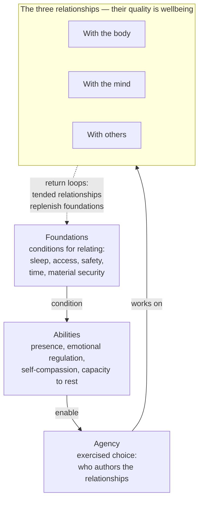
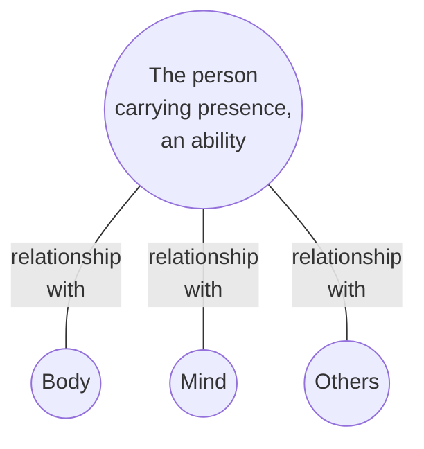

# universal-cake-wellbeing-model-v0.1.0

Version: 0.1.0
Status: Draft

## Purpose

This document defines the Universal Cake model of wellbeing. It is the theory; the companion document, *Universal Cake Wellbeing Evaluation Metrics*, operationalizes it into ratings, gates, and a scorecard for evaluating ideas, tools, and practices that claim to bring about wellbeing. The two documents version independently. This one should change rarely — a change here is a change to the framework's understanding of wellbeing itself. The metrics iterate as evaluation experience accumulates.

What this model works on, at every level, are the qualities of relationships. Wellbeing, as understood here, is the quality of a person's relationships with their body, their mind, and others. The foundations are the conditions those relationships rest on. The abilities are relational capacities. Agency asks who authors the relationships. A claim this unifying stays honest only by staying operational, which is the companion document's job: every relationship in this framework has named parties, measurable qualities, evidence tags, and gates. A relationship whose power balance can be named is a claim; one that cannot is marketing.

## How to read this document

This document is the most upstream object in the system it defines. Every metric, evaluation, radar entry, and adoption decision flows downstream from someone reading and understanding it. If the document itself fails accessibility, the failure propagates through everything built on it, and it propagates invisibly, because the excluded people never arrive. The burden of entry therefore sits with this artifact, not with the reader. The following obligations apply to this document and to every document derived from it, including the companion metrics.

**Prose is normative; diagrams are navigation.** Every diagram in this document is preceded by a brief paragraph describing it, and followed by subsections describing each item it contains. The diagram serves as a map of the subsections below it — the section heading above a diagram names the territory, the diagram sketches it, the subsections below walk it. A reader who cannot see the diagram loses nothing normative; a reader who can see it gains a navigational overview. Mermaid output is treated as illustration, never as the sole carrier of meaning.

**Dual register.** This is the technical reference document. A plain-language companion, targeting a Grade 7 reading level, is a committed deliverable, not an aspiration; its status is tracked in the self-application section below. The companion is the ticket booth; this document is the archive.

**Language feasibility.** Translation of this document is a data file anyone can supply — it is markdown, and nothing in its structure resists translation. Target languages follow the Vishpala commitment: English, Canadian French, Spanish. Current status is tracked in the self-application section.

## The model

Wellbeing is the quality of a person's relationships with their body, their mind, and others. That quality is worked on with abilities the person carries, and those abilities are conditioned by foundations — the conditions for relating at all. Influence flows mainly from foundations upward, but not only upward: relationships tended well replenish the foundations they rest on.

The diagram below maps this section. Each named item in it is described in a subsection following the diagram, in top-to-bottom order: foundations, abilities, agency, the three relationships, wellbeing, and the return loops.

### Foundations

Foundations are the conditions for relating — requirements the relating rests on, not relationships being conducted. Sleep. Access, in both its faces: accessibility, and the languages and modalities of communication. Safety, physical and psychological. Time. Material security.

Foundations are themselves qualities on a continuum, not binaries. Sleep is not present or absent; it is better or worse, and its quality varies nightly. The same is true of safety, of time, of material security, and of most access questions. Foundations condition the abilities available for relationship work — they set the terms, they do not cast the vote. People work on relationships from damaged foundations all the time, at higher cost and lower capacity.

**Upstream reach.** Foundations tend to be high-leverage not by rank but by connectivity: they sit upstream of many effects, so an improvement to one travels. Sleep is the clearest example. Quality of sleep affects a whole lot of things — emotional regulation, the capacity for presence, energy, patience with others — so working on sleep helps a lot, one improvement propagating through the abilities and into all three relationships. Upstream improvements tend to travel furthest. This is the leverage principle behind the effects discussion the companion metrics require of every evaluation, and it is why this document holds itself to its own access obligations: the document is upstream of every evaluation made with it.

**Access as the ticket.** Access deserves naming among the foundations because it is the gate of entry to any practice — and to this framework. A person cannot bring presence to a practice they cannot enter, cannot exercise agency within claims they cannot understand, and receives nothing from a practice that excludes their body, their language, or their way of communicating. Accessibility failures are asymmetries of capability; communication failures — inflated claims, concealed harms, undisclosed costs — are asymmetries of information. Both attack the same point, the person's ability to enter and choose. The tickets are issued by the venue: access is an obligation the practice must meet, not a quality the person must bring.

### Abilities

Abilities are relational capacities the person carries — what remains when the practice, tool, or teacher is taken away. They are conditioned by the foundations and deployed, through agency, to work on the relationships.

- **Presence.** The load-bearing ability, first among them because agency depends on it. A person cannot choose among options they have not noticed, and cannot notice without being there. Presence opens the gap between stimulus and response. It is trainable, it atrophies under hostile conditions — the attention economy is precisely such a condition — it is deployable across all three relationships, and it is measurable with validated instruments.
- **Emotional regulation.** The capacity to notice, name, tolerate, and modulate emotional states — how a person relates to their own states rather than being run by them. Depends on presence; an emotion not noticed cannot be regulated.
- **Self-compassion.** The quality of the relationship with oneself in failure. Practices that motivate through shame work against it, even when they produce short-term compliance.
- **Capacity to rest.** The ability to stop, genuinely, without guilt and without a screen. Increasingly rare, rarely trained, and a legitimate output for a practice to claim.

Two forms of presence are distinguished throughout the framework. **State presence** is being here, now, during an activity itself. **Trait presence** is the cultivated capacity to return to the present, retained after the activity ends. A practice can serve one and not the other: a gripping game engages attention totally and builds nothing transferable; effortful meditation training may be unglamorous in the moment and build the trait. The best practices do both, and the companion metrics evaluate each ability with a paired question — does the subject engage it, and does it build it.

Two honesty clarifications keep the model from mindfulness maximalism. Presence is not sufficient for wellbeing — attention is neutral, and a person can be intensely present in an activity that harms them, or present within a hostile relationship; presence is the bandwidth, relationship quality is what the bandwidth carries. And presence is not strictly necessary for every foundation — sleep involves no presence at all, which is part of why sleep belongs among the foundations rather than the relationships.

This list of abilities is non-exhaustive. New abilities are added as evaluation demands.

### Agency

Agency is exercised choice: the question of who authors the relationships — whether the person's relationships with body, mind, and others are theirs, or arranged for them by someone else's design. Every interaction with any subject can be tested with one question, **whose goal does this interaction serve, and would the person recognize it as their own?**

Dark patterns are attacks on presence in order to defeat agency. Infinite scroll does not argue with a person's goals; it prevents the moment of noticing in which those goals would be consulted. Autoplay removes the stopping point precisely because a stopping point is where presence re-enters and a choice gets made. Manufactured urgency floods the gap so nothing deliberate can happen in it. Supportive patterns are the mirror image: honest defaults, natural endings, and quiet-by-default all protect the gap. Every evaluative question in the companion metrics has a common root: does this subject widen the gap or close it?

### The three relationships

The diagram below maps this subsection: the person at the centre, carrying presence, connected independently to the three domains. Wellbeing lives on the edges — the three lines are the relationships whose quality is being measured — and the paragraphs following the diagram describe the hub reading and each domain.

This is a hub, deliberately not a Venn diagram, and the distinction is load-bearing. A Venn reading would place presence where all three circles intersect, which would make presence require others — contradicted by lived experience, because solitary presence is real and common: awareness of the breath, absorption in a walk, flow in craft work. The opposite reading, presence as mind-and-body only, fails the other way, because relational presence is also real and distinct — deep listening, attunement, actually-being-with. A parent fully present with a child is not doing a mind-body activity that happens to have a person nearby; the presence is in the relating. The hub resolves this: each domain connects to the centre independently, so presence can be brought to any relationship without requiring the other two, and any relationship can be conducted presently or absently.

**With the body.** The physical domain: movement, nourishment, rest, comfort, energy. The relationship can be tended — movement suited to the actual body, eating that sustains, recovery honoured — or hostile: exercise as punishment, moral weight attached to food, rest treated as failure, signals overridden.

**With the mind.** The psychological domain: emotion, attention, meaning, competence. The relationship can be aware — feelings felt and regulated, attention gathered, purposes one's own — or captive: rumination, fragmentation, suppression marketed as calm, goals manufactured by someone else.

**With others.** The relational domain: connection, belonging, contribution, trust. The relationship can be real — deepened connection, unconditional belonging, paths to give, safety to disagree and leave — or simulated: connection displaced by its imitation, belonging conditioned on purchase or conformity, the person positioned permanently as consumer.

### Wellbeing as relationship quality

Wellbeing is how the quality of these three relationships shows up and is measured in this framework — a working definition, not a claim to be the totality of wellbeing. The definition earns its place because it explains what the metrics detect: a hostile relationship with the body is not an absence of movement, rumination is a captive relationship with one's own mind rather than an absence of thought, and simulated connection is a degraded relationship with others while the domain is nominally serviced. Every damaged relationship the companion metrics surface is a wellbeing deficit; every tended one is wellbeing itself. Relationship quality is independently measurable — interoceptive awareness and body-image instruments for the body edge, self-compassion and decentering scales for the mind edge, established relationship-quality measures for the others edge — so the definition remains operational rather than rhetorical.

### Return loops

Influence in the model flows mainly from foundations upward, but the flow is not one-way, and the model must not be read as linear staging. Relationships tended well replenish the foundations they rest on: a tended relationship with the body improves sleep, connection with others builds psychological safety, a good relationship with the mind protects rest. Foundations enable the work, and the work, done well, replenishes the foundations. The dotted return arrow in the model diagram carries this.

## Self-application

This document is the most upstream artifact in its system, so its access obligations are testable requirements, each carrying a status and an evidence tag per the companion metrics' conventions. This section is updated at each version.

| Requirement | Status at 0.1.0 | Evidence | What would resolve it |
|-------------|-----------------|----------|------------------------|
| Prose normative, diagrams navigational | Met by convention in this version — every diagram has a preceding description and following subsections | Inferred | Verification pass with a screen reader against rendered output |
| Reading level of this document measured | Not yet measured | Unknown | Run a readability measure, record instrument, score, and date |
| Plain-language companion (Grade 7 target) | Committed, not yet written | — | Companion drafted, readability Verified |
| Translation feasibility (en, fr-CA, es) | Structurally feasible, en only | Inferred | fr-CA and es translations exist |
| Diagram prose equivalence verified | Written, not tested | Inferred | Screen-reader pass confirming no normative loss |

A wellbeing framework that only the credentialed can read has failed its own first gate before evaluating anything. The Unknown and Inferred tags above are recorded rather than hidden, per the framework's own rules.

## Further scaffolding

For citation, if wanted: Deci and Ryan's Self-Determination Theory (autonomy, competence, relatedness) maps nearly one-to-one onto the mind relationship, the others relationship, and agency. Ryff's psychological wellbeing dimensions and Seligman's PERMA are the standard multi-dimensional wellbeing anchors. Sen and Nussbaum's capability approach grounds the foundations–abilities structure: foundations as conditions, abilities as capabilities, relating done well as functionings. Killingsworth and Gilbert's experience-sampling work grounds the claim that presence multiplies wellbeing largely independent of activity. Frankl grounds the gap between stimulus and response. Measurement instruments for the model's constructs are cited in the companion metrics document.

## Resources

### Related documents

- Universal Cake Wellbeing Evaluation Metrics (companion document, operationalizes this model)
- Universal Cake Evaluation Metrics (parent metrics, shared vocabulary)
- UC Radar Entry Template
- UC Radar Evaluation Lifecycle

## License

This document, *Universal Cake Wellbeing Model*, by **Christopher Steel**, with AI assistance from **Claude (Anthropic)**, is licensed under the [GNU Affero General Public License v3.0 or later](https://www.gnu.org/licenses/agpl-3.0.html).

## Changelog

| Version | Status | Notes |
|---------|--------|-------|
| 0.1.0 | Draft | Initial version, split from universal-cake-wellbeing-evaluation-metrics v0.2.0. Carries the model (foundations, abilities, agency, three relationships, wellbeing as relationship quality, return loops), the document accessibility obligations, and self-application. Evaluation method remains in the companion metrics document |
